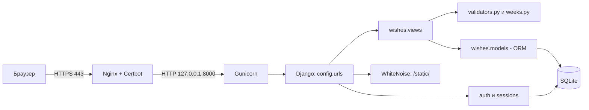
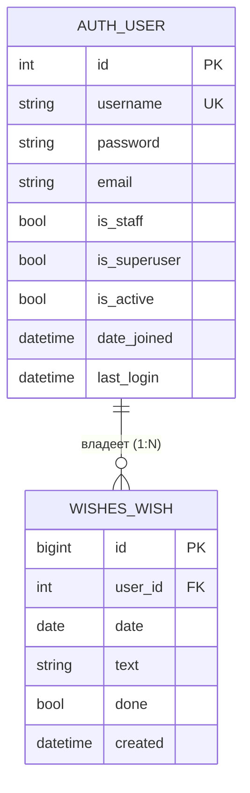

# Документация и DevOps (devops_documentation)

| | |
|---|---|
| **Проект** | Вишлист по неделям (Django, монолит) |
| **Роль** | Технический писатель и DevOps (Documentation & Project Manager) |
| **Автор** | <ФИО студента> |
| **Репозиторий** | 2-sentyabrya-pary-1-3, папка `task_5_devops` |
| **Код проекта** | [`wishlist_django/`](../wishlist_django) |

> Документ состоит из **Части A** (общие разделы 1–6, одинаковые для всех ролей) и **Части B** (акценты роли «Технический писатель и DevOps (Documentation & Project Manager)», в конце план презентации).

---

# ЧАСТЬ A. Общие разделы

## 1. Описание бизнес-логики проекта

**Какую задачу решает система.** «Вишлист по неделям» — веб-приложение для личного планирования желаний: пользователь раскладывает желания (покупки, поездки, дела) по дням недели, отмечает исполненные и видит прогресс недели. Данные каждого пользователя изолированы и доступны только ему после входа.

### 1.1 Сценарии использования (user stories)

| ID | Как… | Хочу… | Чтобы… |
|---|---|---|---|
| US-1 | пользователь | войти по логину и паролю | видеть только свои желания |
| US-2 | пользователь | видеть текущую неделю по дням | планировать на неделю вперёд |
| US-3 | пользователь | листать недели вперёд и назад | смотреть прошлое и планировать будущее |
| US-4 | пользователь | добавить желание в конкретный день | зафиксировать идею |
| US-5 | пользователь | отметить желание выполненным и снять отметку | видеть, что уже исполнено |
| US-6 | пользователь | удалить желание | убирать неактуальное |
| US-7 | пользователь | видеть «выполнено X из Y» за неделю | оценивать прогресс |
| US-8 | администратор | создавать пользователей в `/admin/` | управлять доступом (публичной регистрации нет) |
| US-9 | пользователь | выйти из системы | закрыть доступ на чужом устройстве |

**Use case UC-1 «Добавить желание».** Актор: пользователь. Предусловие: выполнен вход.
Основной поток: (1) выбирает день; (2) вводит текст; (3) нажимает «+» или Enter; (4) система проверяет дату и текст; (5) сохраняет желание с привязкой к пользователю; (6) показывает обновлённую неделю.
Альтернативы: 4a — текст пустой, длиннее 300 символов или дата вне 2000–2100: желание не создаётся, неделя показывается без изменений; 1a — сессия истекла: перенаправление на страницу входа.

### 1.2 Ключевые сущности и их поведение

| Сущность | Что это | Поведение |
|---|---|---|
| `User` | учётная запись (`django.contrib.auth`) | аутентификация, хранение хеша пароля, права |
| `Wish` | желание на конкретный день | `toggle()`, `clean()`, `__str__()` |
| `WeekCalendar` | вычисляемая неделя пн–вс (в БД не хранится) | `monday`, `sunday`, `number`, `dates()`, `contains()`, `shifted()` |
| `TextValidator`, `DateValidator` | валидаторы ввода | очистка и проверка текста и даты |

### 1.3 Бизнес-правила

| № | Правило |
|---|---|
| BR-1 | Желание принадлежит ровно одному пользователю. Чужие желания недоступны (ответ 404). |
| BR-2 | Текст: строка, после очистки от лишних пробелов и управляющих символов длина 1–300. |
| BR-3 | Дата: формат ГГГГ-ММ-ДД, год 2000–2100. |
| BR-4 | Неделя по ISO 8601: понедельник–воскресенье, номер недели по ISO. |
| BR-5 | Новое желание всегда «не выполнено»; `toggle()` переключает статус. |
| BR-6 | Порядок в дне: сначала невыполненные, затем выполненные; внутри — по времени создания. |
| BR-7 | Удаление необратимо. При удалении пользователя удаляются и его желания (CASCADE). |
| BR-8 | Изменения данных — только методом POST и с CSRF-токеном. |
| BR-9 | Некорректный параметр недели `?d=` → показывается текущая неделя. |
| BR-10 | Публичной регистрации нет, пользователей создаёт администратор. |

## 2. Тип архитектуры: монолит

**Выбор: монолит** (одно Django-приложение, MVT: Model–View–Template).

**Обоснование:** одна предметная область (желания по дням), один разработчик/команда студентов, нагрузка — десятки пользователей, нужно быстро развернуть и просто сопровождать. Микросервисы добавили бы сетевые вызовы, отдельные БД, оркестрацию и распределённую безопасность без реальной пользы.



| Слой / модуль | Ответственность |
|---|---|
| `config/` | настройки, маршруты, WSGI |
| `wishes/urls.py` | маршруты приложения |
| `wishes/views.py` | контроллеры: приём запроса, проверки доступа, ответ |
| `wishes/validators.py`, `wishes/weeks.py` | бизнес-логика без зависимости от Django |
| `wishes/models.py` | модель `Wish`, доступ к БД через ORM |
| `templates/` | представление (HTML) |
| Nginx / Gunicorn | веб-сервер и сервер приложений |

| Плюсы для проекта | Минусы / ограничения |
|---|---|
| Простая разработка, отладка и развёртывание | Масштабируется только целиком |
| Одна БД, транзакции без распределённых проблем | Ошибка в одном модуле может уронить весь сайт |
| Встроенные в Django защита и админка | SQLite плохо подходит для большого числа одновременных записей |
| Дёшево: хватает одного маленького сервера | При росте команды модули придётся разделять |

*Когда пересматривать:* появятся мобильные клиенты, общие списки желаний, уведомления — тогда логично выделить API и перейти на PostgreSQL.

## 3. Хранение данных

- **СУБД:** SQLite, один файл (`DB_PATH`, на сервере `/var/lib/wishlist/db.sqlite3`).
- **Сессии:** в той же БД (таблица `django_session`).
- **Файлы:** только статика (CSS админки), собирается `collectstatic` и отдаётся WhiteNoise.
- **Кэш и облако:** не используются.
- **Резервные копии:** копирование файла БД (см. раздел «Сопровождение»).

| Сущность (таблица) | Атрибуты |
|---|---|
| `auth_user` | id, username (уникальный), password (хеш), email, first_name, last_name, is_staff, is_superuser, is_active, date_joined, last_login |
| `wishes_wish` | id, user_id (внешний ключ), date (с индексом), text (до 300 символов), done, created |
| `django_session` | session_key, session_data, expire_date |



### Виды связей в БД

| Связь | Что значит | Пример для проекта |
|---|---|---|
| **1:N** (реализована) | один пользователь — много желаний | `Wish.user = ForeignKey(User)`: у `anna` 20 желаний, у каждого желания один владелец |
| **1:1** (возможное расширение) | одна запись соответствует ровно одной | профиль пользователя: `Profile.user = OneToOneField(User)` (часовой пояс, тема оформления) |
| **M:N** (возможное расширение) | много ко многим | теги: `Wish.tags = ManyToManyField(Tag)`; желание «Поездка» с тегами «отпуск» и «друзья», тег «отпуск» у многих желаний |

В текущей версии реализована только связь 1:N; 1:1 и M:N показаны как план развития и в миграциях отсутствуют.

## 4. Проверка безопасности приложения

| Угроза | Актуальна? | Мера защиты | Где в проекте |
|---|---|---|---|
| SQL-инъекция | да | ORM с параметризованными запросами, сырой SQL не используется | `models.py`, `views.py` |
| XSS | да | автоэкранирование шаблонов Django; текст желания не помечается как `safe` | `templates/wishes/week.html` |
| CSRF | да | `CsrfViewMiddleware`, `` во всех формах, изменения только POST | `settings.py`, `@require_POST` |
| Слабая аутентификация | да | пароли хешируются (PBKDF2-SHA256 по умолчанию), `AUTH_PASSWORD_VALIDATORS`, публичной регистрации нет | `settings.py` |
| Доступ к чужим данным (IDOR) | да | выборка только `user=request.user`, иначе 404 | `views.py: toggle, delete, week` |
| Утечка секретов | да | `SECRET_KEY` и хосты берутся из переменных окружения; при `DEBUG=0` без ключа запуск прерывается | `settings.py` |
| Перехват трафика | да | HTTPS (Let's Encrypt), `SESSION_COOKIE_SECURE`, `CSRF_COOKIE_SECURE`, `SECURE_PROXY_SSL_HEADER` | nginx, `settings.py` |
| Clickjacking | да | `XFrameOptionsMiddleware` | `settings.py` |
| Некорректный ввод | да | `TextValidator`, `DateValidator`, повторная проверка на сервере | `validators.py` |
| Подбор пароля | да | **пока не реализовано** (рекомендации: django-axes или fail2ban, ограничение запросов в nginx) | — |
| Логирование и аудит | частично | журналы nginx и `journalctl -u wishlist`; бизнес-аудит не ведётся | сервер |

**Инкапсуляция и защита данных в коде.** Состояние классов хранится в приватных атрибутах (`_max_length`, `_min_year`, `_monday`); наружу оно выходит только через свойства (геттеры) и сеттер с проверкой (`max_length`, `set_anchor()`). Метод `_check()` защищённый и вызывается только через `__call__`. Типы проверяются явно (`isinstance`), при нарушении поднимается `ValueError`.

## 5. Законы и нормативные акты для внедрения ИС

> Учебный материал, не юридическая консультация. Перед реальным запуском сверьтесь с актуальной редакцией законов.

| Акт | Что важно для проекта |
|---|---|
| **152-ФЗ «О персональных данных»** | Логин, e-mail, IP-адреса в журналах и текст желаний (может содержать личные сведения) — персональные данные. Нужны правовое основание, цели обработки, меры защиты. С 1 сентября 2025 г. (ФЗ от 24.06.2025 № 156-ФЗ) согласие оформляется **отдельно** от других документов и условий. |
| **242-ФЗ (изменения в 152-ФЗ)** | Первичный сбор и хранение ПДн граждан РФ — в базах на территории РФ. Это важно при выборе страны размещения сервера. |
| **149-ФЗ «Об информации, информационных технологиях и о защите информации»** | Обязанности по защите информации и ограничению доступа к ней. |
| **GDPR** (если пользователи или сервер в ЕС) | Законность и прозрачность обработки (ст. 5–6, 13), права пользователя (доступ, удаление), безопасность обработки (ст. 32), уведомление о утечке в 72 часа (ст. 33). |

**Что учесть при сборе, хранении и обработке:**
1. Собирать минимум: логин, пароль (только хеш), текст желаний. E-mail не обязателен.
2. Если появится публичная регистрация: страница **политики конфиденциальности**, **отдельная** галочка согласия (не включённая в пользовательское соглашение), возможность удалить аккаунт и данные.
3. Определить сроки хранения и порядок удаления данных; хранить резервные копии не дольше необходимого.
4. Разместить сервер в допустимой юрисдикции; при передаче данных третьим лицам (хостинг, почта) — отдельные основания.
5. Иметь процедуру реагирования на инциденты (уведомление Роскомнадзора по 152-ФЗ, надзорного органа по GDPR).
6. Cookies: проект использует только технические (сессия, CSRF), без аналитики и рекламы.

## 6. Документы к каждому этапу разработки

| Этап | Документы | Где в репозитории |
|---|---|---|
| Анализ требований | список требований, user stories, бизнес-правила | Часть A, разделы 1.1–1.3 |
| Проектирование | UML классов и последовательностей, ER-диаграмма, схема архитектуры | `task_1_architect/uml_class_diagram.md`, разделы 2–3 |
| Разработка | описание модулей, структура кода, docstring, README | `wishlist_django/`, `task_5_devops/` |
| Тестирование | тест-план, чек-листы, отчёты о дефектах, автотесты | `task_4_qa/qa_test_plan.md`, `wishes/tests.py`, `wishes/test_pure.py` |
| Внедрение | инструкция по развёртыванию, руководство пользователя, план миграции | `docs/guide_wishlist.md`, `task_5_devops/` |
| Сопровождение | регламент обновлений, резервное копирование, мониторинг | `task_5_devops/devops_documentation.md` |

---

# ЧАСТЬ B. Акценты роли: Технический писатель и DevOps

## B1. Структура репозитория

```
2-sentyabrya-pary-1-3/
├── README.md                      # описание проекта, запуск, роли
├── .gitignore
├── .github/workflows/tests.yml    # автотесты при push и merge request
├── docs/
│   └── guide_wishlist.md          # пошаговое руководство по запуску и деплою
├── wishlist_django/               # код проекта
│   ├── manage.py
│   ├── requirements.txt, requirements-dev.txt, pytest.ini
│   ├── config/                    # настройки, urls, wsgi
│   ├── wishes/                    # приложение: models, views, validators, weeks, tests
│   └── templates/                 # base.html, wishes/week.html, registration/login.html
├── task_1_architect/              # architecture_core.md, README.md, uml_class_diagram.md
├── task_2_frontend/               # ui_integration.md, README.md, screenshots/
├── task_3_security/               # security_validation.md, README.md
├── task_4_qa/                     # qa_test_plan.md, README.md
└── task_5_devops/                 # devops_documentation.md, README.md, uml_class_diagram.md
```
Правило именования папок заданий: `task_<номер>_<роль>`. Если номер задания другой, переименуйте папки.

## B2. Работа с GitHub

**Первая отправка проекта:**
```bash
cd 2-sentyabrya-pary-1-3
git init
git add .
git commit -m "chore: initial commit"
git branch -M main
git remote add origin https://github.com/<логин>/2-sentyabrya-pary-1-3.git
git push -u origin main
git checkout -b dev && git push -u origin dev
```

**Ветки:**

| Ветка | Назначение |
|---|---|
| `main` | стабильная версия, только через merge request, защищена |
| `dev` | интеграция, сюда вливаются задачи |
| `feature/<роль>-<тема>` | работа конкретного участника, например `feature/qa-tests`, `feature/security-validators` |

**Процесс merge request (pull request):**
1. `git checkout -b feature/devops-readme dev`
2. Правки и коммиты: `git commit -m "docs: обновить README"`
3. `git push -u origin feature/devops-readme`
4. На GitHub: **Compare & pull request** → база `dev` → описание «что и зачем».
5. Должен пройти зелёный CI; минимум одно ревью другого участника.
6. Слияние (Squash and merge), удаление ветки. Затем PR `dev → main` для релиза.

**Формат коммитов:** `feat:` новая возможность, `fix:` исправление, `docs:` документация, `test:` тесты, `chore:` служебное. Пример: `fix: отклонять некорректную дату при добавлении желания`.

**Чек-лист ревью:** тесты зелёные; нет секретов в коде; у новых классов и методов есть docstring; документация обновлена.

## B3. UML-диаграммы

Диаграмма классов и диаграмма последовательности — в файле `uml_class_diagram.md` (Mermaid, GitHub отображает автоматически). Схемы архитектуры и ER — в Части A, разделы 2 и 3.

## B4. README.md и docstring

**README.md проекта** лежит в корне репозитория; в нём: описание, структура, запуск, тесты, деплой, таблица ролей. Шаблон разделов: *Описание → Возможности → Установка → Запуск → Тесты → Деплой → Структура → Лицензия/контакты*.

**Docstring** — обязателен для каждого модуля, класса и публичного метода. Стиль: краткая первая строка (что делает), затем при необходимости детали.

```python
class WeekCalendar:
    """Неделя, в которой лежит заданная дата.

    Состояние хранится в приватном атрибуте _monday; снаружи доступны
    только чтение через свойства и безопасное изменение через set_anchor().
    """

    def shifted(self, weeks):
        """Новая неделя со сдвигом на weeks недель (можно отрицательное число)."""
```
Посмотреть документацию из кода: `python -m pydoc wishes.validators` и `python -m pydoc wishes.weeks` (запускать из папки `wishlist_django`).

## B5. CI: автоматическая проверка

Файл `.github/workflows/tests.yml` при каждом push в `main`/`dev` и при каждом merge request: ставит Python 3.12 и зависимости, проверяет, что нет забытых миграций (`makemigrations --check --dry-run`), запускает все тесты. Красный CI — повод не вливать ветку.

## B6. Внедрение

Пошаговая инструкция (локальный запуск, VPS, домен, nginx, HTTPS) — `docs/guide_wishlist.md`. Руководство пользователя: войти → выбрать день → вписать желание и нажать «+» → клик по желанию отмечает его → ✕ удаляет → «Назад/Вперёд» листают недели.

**План миграции на PostgreSQL (при росте нагрузки):**
1. Сделать резервную копию SQLite и выгрузить данные: `python manage.py dumpdata --natural-foreign --exclude contenttypes --exclude auth.permission > data.json`.
2. Поставить PostgreSQL и `psycopg`, изменить `DATABASES` в `settings.py`.
3. `python manage.py migrate` на пустой БД, затем `python manage.py loaddata data.json`.
4. Проверить тестами и вручную, переключить сервис, оставить SQLite-копию на случай отката.

## B7. Сопровождение

| Задача | Как | Периодичность |
|---|---|---|
| Обновление кода | загрузить новую версию, `migrate`, `collectstatic`, `chown`, `systemctl restart wishlist` (см. руководство) | по мере выхода версий, через ветку `dev` и CI |
| Обновление зависимостей | `pip list --outdated`, затем тесты | раз в месяц |
| Обновление ОС | `apt update && apt upgrade -y` | раз в месяц |
| Резервная копия БД | `cp /var/lib/wishlist/db.sqlite3 /var/backups/wishlist-$(date +%F).sqlite3` (можно через cron) и копия на другой носитель | ежедневно / еженедельно |
| Проверка копии | восстановить на тестовом окружении | раз в квартал |
| Мониторинг сервиса | `systemctl status wishlist`, `journalctl -u wishlist -n 50` | при инцидентах |
| Мониторинг доступности | внешний пинг (например, UptimeRobot) на адрес сайта | постоянно |
| Продление сертификата | `certbot renew --dry-run` (таймер certbot продлевает сам) | раз в квартал проверить |
| Инцидент с данными | остановить сервис, сменить `SECRET_KEY` и пароли, оценить масштаб, уведомить регулятор и пользователей по закону | по факту |

Пример cron для ежедневной копии (`crontab -e`):
```
0 3 * * * cp /var/lib/wishlist/db.sqlite3 /var/backups/wishlist-$(date +\%F).sqlite3
```

## B8. Законы и документы (совместно с ролью безопасности)

Анализ законов — Часть A, раздел 5 и таблица в `task_3_security/security_validation.md`. Комплект документов для публичного запуска:

| Документ | Статус в проекте |
|---|---|
| Политика обработки и защиты персональных данных | нужна при публичной регистрации |
| Согласие на обработку ПДн (отдельный документ или отдельная галочка) | нужно при публичной регистрации |
| Регламент реагирования на инциденты | черновик: раздел B7, строка «Инцидент с данными» |
| Регламент резервного копирования | раздел B7 |
| Приказ о назначении ответственного за ПДн (для организации) | при внедрении в организации |

## B9. Материалы для финальной презентации

**Структура общей защиты проекта (демонстрация ≈ 2 минуты):** 1) задача и бизнес-логика; 2) архитектура-монолит; 3) демонстрация сайта: вход → неделя → добавить → отметить → удалить; 4) безопасность и законы; 5) тесты и CI; 6) репозиторий и документация; 7) план развития.

**Что подготовить:** запущенный сайт или записанное видео, скриншоты (`task_2_frontend/screenshots/`), скриншот зелёного CI и результата тестов, ссылки на репозиторий и домен.

## B10. Презентация (5–7 слайдов)

1. Проект и роль, ссылка на репозиторий.
2. Структура репозитория (дерево).
3. Ветки и merge request: процесс и формат коммитов.
4. README и docstring: примеры.
5. UML-диаграмма классов.
6. CI и сопровождение: тесты, резервные копии, мониторинг.
7. Внедрение на домен и материалы к финальной защите.
