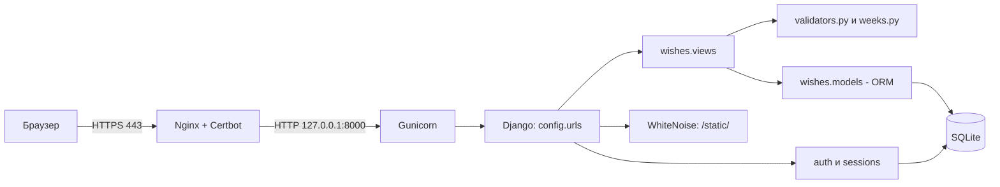
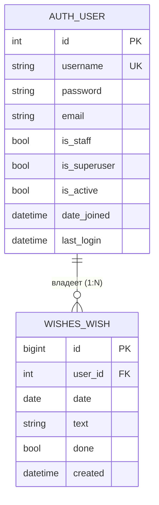

# Интеграция интерфейса (ui_integration)

| | |
|---|---|
| **Проект** | Вишлист по неделям (Django, монолит) |
| **Роль** | Разработчик интерфейса (Frontend / UI Integration) |
| **Автор** | <ФИО студента> |
| **Репозиторий** | 2-sentyabrya-pary-1-3, папка `task_2_frontend` |
| **Код проекта** | [`wishlist_django/`](../wishlist_django) |

> Документ состоит из **Части A** (общие разделы 1–6, одинаковые для всех ролей) и **Части B** (акценты роли «Разработчик интерфейса (Frontend / UI Integration)», в конце план презентации).

---

# ЧАСТЬ A. Общие разделы

## 1. Описание бизнес-логики проекта

**Какую задачу решает система.** «Вишлист по неделям» — веб-приложение для личного планирования желаний: пользователь раскладывает желания (покупки, поездки, дела) по дням недели, отмечает исполненные и видит прогресс недели. Данные каждого пользователя изолированы и доступны только ему после входа.

### 1.1 Сценарии использования (user stories)

| ID | Как… | Хочу… | Чтобы… |
|---|---|---|---|
| US-1 | пользователь | войти по логину и паролю | видеть только свои желания |
| US-2 | пользователь | видеть текущую неделю по дням | планировать на неделю вперёд |
| US-3 | пользователь | листать недели вперёд и назад | смотреть прошлое и планировать будущее |
| US-4 | пользователь | добавить желание в конкретный день | зафиксировать идею |
| US-5 | пользователь | отметить желание выполненным и снять отметку | видеть, что уже исполнено |
| US-6 | пользователь | удалить желание | убирать неактуальное |
| US-7 | пользователь | видеть «выполнено X из Y» за неделю | оценивать прогресс |
| US-8 | администратор | создавать пользователей в `/admin/` | управлять доступом (публичной регистрации нет) |
| US-9 | пользователь | выйти из системы | закрыть доступ на чужом устройстве |

**Use case UC-1 «Добавить желание».** Актор: пользователь. Предусловие: выполнен вход.
Основной поток: (1) выбирает день; (2) вводит текст; (3) нажимает «+» или Enter; (4) система проверяет дату и текст; (5) сохраняет желание с привязкой к пользователю; (6) показывает обновлённую неделю.
Альтернативы: 4a — текст пустой, длиннее 300 символов или дата вне 2000–2100: желание не создаётся, неделя показывается без изменений; 1a — сессия истекла: перенаправление на страницу входа.

### 1.2 Ключевые сущности и их поведение

| Сущность | Что это | Поведение |
|---|---|---|
| `User` | учётная запись (`django.contrib.auth`) | аутентификация, хранение хеша пароля, права |
| `Wish` | желание на конкретный день | `toggle()`, `clean()`, `__str__()` |
| `WeekCalendar` | вычисляемая неделя пн–вс (в БД не хранится) | `monday`, `sunday`, `number`, `dates()`, `contains()`, `shifted()` |
| `TextValidator`, `DateValidator` | валидаторы ввода | очистка и проверка текста и даты |

### 1.3 Бизнес-правила

| № | Правило |
|---|---|
| BR-1 | Желание принадлежит ровно одному пользователю. Чужие желания недоступны (ответ 404). |
| BR-2 | Текст: строка, после очистки от лишних пробелов и управляющих символов длина 1–300. |
| BR-3 | Дата: формат ГГГГ-ММ-ДД, год 2000–2100. |
| BR-4 | Неделя по ISO 8601: понедельник–воскресенье, номер недели по ISO. |
| BR-5 | Новое желание всегда «не выполнено»; `toggle()` переключает статус. |
| BR-6 | Порядок в дне: сначала невыполненные, затем выполненные; внутри — по времени создания. |
| BR-7 | Удаление необратимо. При удалении пользователя удаляются и его желания (CASCADE). |
| BR-8 | Изменения данных — только методом POST и с CSRF-токеном. |
| BR-9 | Некорректный параметр недели `?d=` → показывается текущая неделя. |
| BR-10 | Публичной регистрации нет, пользователей создаёт администратор. |

## 2. Тип архитектуры: монолит

**Выбор: монолит** (одно Django-приложение, MVT: Model–View–Template).

**Обоснование:** одна предметная область (желания по дням), один разработчик/команда студентов, нагрузка — десятки пользователей, нужно быстро развернуть и просто сопровождать. Микросервисы добавили бы сетевые вызовы, отдельные БД, оркестрацию и распределённую безопасность без реальной пользы.



| Слой / модуль | Ответственность |
|---|---|
| `config/` | настройки, маршруты, WSGI |
| `wishes/urls.py` | маршруты приложения |
| `wishes/views.py` | контроллеры: приём запроса, проверки доступа, ответ |
| `wishes/validators.py`, `wishes/weeks.py` | бизнес-логика без зависимости от Django |
| `wishes/models.py` | модель `Wish`, доступ к БД через ORM |
| `templates/` | представление (HTML) |
| Nginx / Gunicorn | веб-сервер и сервер приложений |

| Плюсы для проекта | Минусы / ограничения |
|---|---|
| Простая разработка, отладка и развёртывание | Масштабируется только целиком |
| Одна БД, транзакции без распределённых проблем | Ошибка в одном модуле может уронить весь сайт |
| Встроенные в Django защита и админка | SQLite плохо подходит для большого числа одновременных записей |
| Дёшево: хватает одного маленького сервера | При росте команды модули придётся разделять |

*Когда пересматривать:* появятся мобильные клиенты, общие списки желаний, уведомления — тогда логично выделить API и перейти на PostgreSQL.

## 3. Хранение данных

- **СУБД:** SQLite, один файл (`DB_PATH`, на сервере `/var/lib/wishlist/db.sqlite3`).
- **Сессии:** в той же БД (таблица `django_session`).
- **Файлы:** только статика (CSS админки), собирается `collectstatic` и отдаётся WhiteNoise.
- **Кэш и облако:** не используются.
- **Резервные копии:** копирование файла БД (см. раздел «Сопровождение»).

| Сущность (таблица) | Атрибуты |
|---|---|
| `auth_user` | id, username (уникальный), password (хеш), email, first_name, last_name, is_staff, is_superuser, is_active, date_joined, last_login |
| `wishes_wish` | id, user_id (внешний ключ), date (с индексом), text (до 300 символов), done, created |
| `django_session` | session_key, session_data, expire_date |



### Виды связей в БД

| Связь | Что значит | Пример для проекта |
|---|---|---|
| **1:N** (реализована) | один пользователь — много желаний | `Wish.user = ForeignKey(User)`: у `anna` 20 желаний, у каждого желания один владелец |
| **1:1** (возможное расширение) | одна запись соответствует ровно одной | профиль пользователя: `Profile.user = OneToOneField(User)` (часовой пояс, тема оформления) |
| **M:N** (возможное расширение) | много ко многим | теги: `Wish.tags = ManyToManyField(Tag)`; желание «Поездка» с тегами «отпуск» и «друзья», тег «отпуск» у многих желаний |

В текущей версии реализована только связь 1:N; 1:1 и M:N показаны как план развития и в миграциях отсутствуют.

## 4. Проверка безопасности приложения

| Угроза | Актуальна? | Мера защиты | Где в проекте |
|---|---|---|---|
| SQL-инъекция | да | ORM с параметризованными запросами, сырой SQL не используется | `models.py`, `views.py` |
| XSS | да | автоэкранирование шаблонов Django; текст желания не помечается как `safe` | `templates/wishes/week.html` |
| CSRF | да | `CsrfViewMiddleware`, `` во всех формах, изменения только POST | `settings.py`, `@require_POST` |
| Слабая аутентификация | да | пароли хешируются (PBKDF2-SHA256 по умолчанию), `AUTH_PASSWORD_VALIDATORS`, публичной регистрации нет | `settings.py` |
| Доступ к чужим данным (IDOR) | да | выборка только `user=request.user`, иначе 404 | `views.py: toggle, delete, week` |
| Утечка секретов | да | `SECRET_KEY` и хосты берутся из переменных окружения; при `DEBUG=0` без ключа запуск прерывается | `settings.py` |
| Перехват трафика | да | HTTPS (Let's Encrypt), `SESSION_COOKIE_SECURE`, `CSRF_COOKIE_SECURE`, `SECURE_PROXY_SSL_HEADER` | nginx, `settings.py` |
| Clickjacking | да | `XFrameOptionsMiddleware` | `settings.py` |
| Некорректный ввод | да | `TextValidator`, `DateValidator`, повторная проверка на сервере | `validators.py` |
| Подбор пароля | да | **пока не реализовано** (рекомендации: django-axes или fail2ban, ограничение запросов в nginx) | — |
| Логирование и аудит | частично | журналы nginx и `journalctl -u wishlist`; бизнес-аудит не ведётся | сервер |

**Инкапсуляция и защита данных в коде.** Состояние классов хранится в приватных атрибутах (`_max_length`, `_min_year`, `_monday`); наружу оно выходит только через свойства (геттеры) и сеттер с проверкой (`max_length`, `set_anchor()`). Метод `_check()` защищённый и вызывается только через `__call__`. Типы проверяются явно (`isinstance`), при нарушении поднимается `ValueError`.

## 5. Законы и нормативные акты для внедрения ИС

> Учебный материал, не юридическая консультация. Перед реальным запуском сверьтесь с актуальной редакцией законов.

| Акт | Что важно для проекта |
|---|---|
| **152-ФЗ «О персональных данных»** | Логин, e-mail, IP-адреса в журналах и текст желаний (может содержать личные сведения) — персональные данные. Нужны правовое основание, цели обработки, меры защиты. С 1 сентября 2025 г. (ФЗ от 24.06.2025 № 156-ФЗ) согласие оформляется **отдельно** от других документов и условий. |
| **242-ФЗ (изменения в 152-ФЗ)** | Первичный сбор и хранение ПДн граждан РФ — в базах на территории РФ. Это важно при выборе страны размещения сервера. |
| **149-ФЗ «Об информации, информационных технологиях и о защите информации»** | Обязанности по защите информации и ограничению доступа к ней. |
| **GDPR** (если пользователи или сервер в ЕС) | Законность и прозрачность обработки (ст. 5–6, 13), права пользователя (доступ, удаление), безопасность обработки (ст. 32), уведомление о утечке в 72 часа (ст. 33). |

**Что учесть при сборе, хранении и обработке:**
1. Собирать минимум: логин, пароль (только хеш), текст желаний. E-mail не обязателен.
2. Если появится публичная регистрация: страница **политики конфиденциальности**, **отдельная** галочка согласия (не включённая в пользовательское соглашение), возможность удалить аккаунт и данные.
3. Определить сроки хранения и порядок удаления данных; хранить резервные копии не дольше необходимого.
4. Разместить сервер в допустимой юрисдикции; при передаче данных третьим лицам (хостинг, почта) — отдельные основания.
5. Иметь процедуру реагирования на инциденты (уведомление Роскомнадзора по 152-ФЗ, надзорного органа по GDPR).
6. Cookies: проект использует только технические (сессия, CSRF), без аналитики и рекламы.

## 6. Документы к каждому этапу разработки

| Этап | Документы | Где в репозитории |
|---|---|---|
| Анализ требований | список требований, user stories, бизнес-правила | Часть A, разделы 1.1–1.3 |
| Проектирование | UML классов и последовательностей, ER-диаграмма, схема архитектуры | `task_1_architect/uml_class_diagram.md`, разделы 2–3 |
| Разработка | описание модулей, структура кода, docstring, README | `wishlist_django/`, `task_5_devops/` |
| Тестирование | тест-план, чек-листы, отчёты о дефектах, автотесты | `task_4_qa/qa_test_plan.md`, `wishes/tests.py`, `wishes/test_pure.py` |
| Внедрение | инструкция по развёртыванию, руководство пользователя, план миграции | `docs/guide_wishlist.md`, `task_5_devops/` |
| Сопровождение | регламент обновлений, резервное копирование, мониторинг | `task_5_devops/devops_documentation.md` |

---

# ЧАСТЬ B. Акценты роли: Разработчик интерфейса (Frontend / UI Integration)

## B1. Как организован интерфейс

**Тип интерфейса: веб** (серверный рендеринг Django-шаблонов, чистые HTML и CSS, без JavaScript-фреймворков). Тема оформления светлая/тёмная переключается автоматически по настройке устройства (`prefers-color-scheme`), раскладка адаптивная (`grid` с `auto-fill`).

| Экран | URL | Шаблон | Что делает |
|---|---|---|---|
| Вход | `/accounts/login/` | `registration/login.html` | форма логина и пароля |
| Неделя | `/` и `/?d=ГГГГ-ММ-ДД` | `wishes/week.html` | 7 карточек-дней, навигация, формы |
| Добавить | `POST /add/` | (редирект на неделю) | создание желания |
| Отметить | `POST /toggle/<id>/` | (редирект) | выполнено / не выполнено |
| Удалить | `POST /delete/<id>/` | (редирект) | удаление |
| Выход | `POST /accounts/logout/` | (редирект на вход) | завершение сессии |

Шаблоны наследуются: `base.html` (шапка, стили, кнопка «Выйти») → `week.html`, `login.html`.

### Макет экрана «Неделя»

```
┌──────────────────────────────────────────────────────────────┐
│ ✨ Мой вишлист                              anna  [Выйти]    │
├──────────────────────────────────────────────────────────────┤
│ Неделя 41                         [← Назад] [Сегодня] [Вперёд →]│
│ 5 октября – 11 октября 2026 · выполнено 1 из 3               │
├───────────────┬───────────────┬───────────────┬──────────────┤
│ Понедельник   │ Вторник       │ Среда ◄ сегодня│ Четверг     │
│ 5.10          │ 6.10          │ 7.10          │ 8.10         │
│ ✔ Купить книгу│ Пока пусто    │ ☐ Поехать...✕ │ Пока пусто   │
│ [Новое...][+] │ [Новое...][+] │ [Новое...][+] │ [Новое...][+]│
└───────────────┴───────────────┴───────────────┴──────────────┘
         (на узком экране карточки перестраиваются в одну колонку)
```

## B2. Соблюдение инкапсуляции: интерфейс работает только через публичный API ядра

Правило слоёв: **Шаблон → View → Ядро (модель, `WeekCalendar`, валидаторы)**. Шаблон не обращается к БД и не знает о внутренностях классов.

| Что делает интерфейс | Через что (публичная точка) | Чего он НЕ делает |
|---|---|---|
| выводит неделю | словарь `context` из `views.week` | не читает приватный `_monday`, не делает запросов в шаблоне |
| отмечает желание | `POST /toggle/<id>/` → `Wish.toggle()` | не меняет поле `done` напрямую |
| проверяет ввод | `clean_text`, `clean_date` на сервере | не доверяет проверкам браузера |
| считает соседние недели | `WeekCalendar.shifted()` → `prev_week`, `next_week` | не вычисляет даты в HTML |

**ViewModel (контекст страницы недели)** — единственный контракт между ядром и шаблоном:

| Ключ | Тип | Смысл |
|---|---|---|
| `days` | список из 7 словарей `{date, name, wishes, today}` | карточки дней |
| `monday`, `sunday` | `date` | границы недели |
| `week_number` | `int` | номер недели ISO |
| `prev_week`, `next_week` | `str` (ГГГГ-ММ-ДД) | ссылки навигации |
| `is_current` | `bool` | показывать ли кнопку «Сегодня» |
| `total`, `done` | `int` | счётчик прогресса |

**View-классы и обёртки.** Роль View-слоя играют функции `week`, `add`, `toggle`, `delete` и вспомогательные `_date_or`, `_back`; роль «обёртки» над датой недели — класс `WeekCalendar`.

## B3. Сценарии ввода и вывода

| Сценарий | Ввод пользователя | Реакция / вывод |
|---|---|---|
| Вход | логин, пароль | неверные данные → сообщение «Неверный логин или пароль»; верные → неделя |
| Добавить желание | текст (до 300 символов) + «+» или Enter | карточка обновляется, поле очищается |
| Пустой или слишком длинный текст | — | желание не создаётся, неделя показывается без изменений |
| Отметить выполненным | клик по тексту желания | ☐ меняется на ✔, текст зачёркивается и серый, счётчик растёт |
| Удалить | клик по ✕ | желание исчезает |
| Навигация | «Назад» / «Вперёд» / «Сегодня» | показывается другая неделя, заголовок и номер обновляются |
| Подмена адреса `?d=abc` | вручную в адресной строке | показывается текущая неделя |
| Выход | кнопка «Выйти» | страница входа |

**Защита на уровне интерфейса:** `maxlength="300"` и `required` в поле ввода (удобство), скрытое поле `date` и `` в каждой форме, экранирование текста шаблоном. Серверная проверка обязательна и дублирует клиентскую.

## B4. Скриншоты (вставить перед сдачей)

Сделайте скриншоты работающего сайта и положите в папку `screenshots/` рядом с этим файлом:

| Файл | Что снять |
|---|---|
| `01_login.png` | страница входа |
| `02_week.png` | неделя с несколькими желаниями |
| `03_done.png` | выполненное (зачёркнутое) желание |
| `04_mobile.png` | узкое окно (F12 → режим телефона) |
| `05_dark.png` | тёмная тема (переключить тему ОС) |


## B5. Презентация (5–7 слайдов)

1. Тип интерфейса и экраны (таблица экранов).
2. Схема «Шаблон → View → Ядро» и правило инкапсуляции.
3. Макет экрана «Неделя» + скриншот.
4. Контракт `context` (ViewModel).
5. Сценарии ввода/вывода: добавить, отметить, удалить.
6. Защита на уровне интерфейса: CSRF, экранирование, серверная валидация.
7. Адаптивность, тёмная тема, идеи развития.
