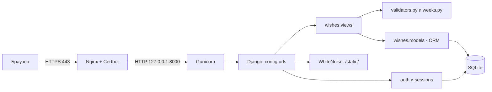
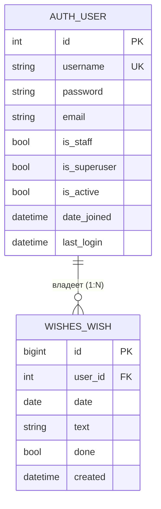

# Тест-план и тестирование (qa_test_plan)

| | |
|---|---|
| **Проект** | Вишлист по неделям (Django, монолит) |
| **Роль** | Инженер по качеству и тестированию (QA / Test Automation) |
| **Автор** | <ФИО студента> |
| **Репозиторий** | 2-sentyabrya-pary-1-3, папка `task_4_qa` |
| **Код проекта** | [`wishlist_django/`](../wishlist_django) |

> Документ состоит из **Части A** (общие разделы 1–6, одинаковые для всех ролей) и **Части B** (акценты роли «Инженер по качеству и тестированию (QA / Test Automation)», в конце план презентации).

---

# ЧАСТЬ A. Общие разделы

## 1. Описание бизнес-логики проекта

**Какую задачу решает система.** «Вишлист по неделям» — веб-приложение для личного планирования желаний: пользователь раскладывает желания (покупки, поездки, дела) по дням недели, отмечает исполненные и видит прогресс недели. Данные каждого пользователя изолированы и доступны только ему после входа.

### 1.1 Сценарии использования (user stories)

| ID | Как… | Хочу… | Чтобы… |
|---|---|---|---|
| US-1 | пользователь | войти по логину и паролю | видеть только свои желания |
| US-2 | пользователь | видеть текущую неделю по дням | планировать на неделю вперёд |
| US-3 | пользователь | листать недели вперёд и назад | смотреть прошлое и планировать будущее |
| US-4 | пользователь | добавить желание в конкретный день | зафиксировать идею |
| US-5 | пользователь | отметить желание выполненным и снять отметку | видеть, что уже исполнено |
| US-6 | пользователь | удалить желание | убирать неактуальное |
| US-7 | пользователь | видеть «выполнено X из Y» за неделю | оценивать прогресс |
| US-8 | администратор | создавать пользователей в `/admin/` | управлять доступом (публичной регистрации нет) |
| US-9 | пользователь | выйти из системы | закрыть доступ на чужом устройстве |

**Use case UC-1 «Добавить желание».** Актор: пользователь. Предусловие: выполнен вход.
Основной поток: (1) выбирает день; (2) вводит текст; (3) нажимает «+» или Enter; (4) система проверяет дату и текст; (5) сохраняет желание с привязкой к пользователю; (6) показывает обновлённую неделю.
Альтернативы: 4a — текст пустой, длиннее 300 символов или дата вне 2000–2100: желание не создаётся, неделя показывается без изменений; 1a — сессия истекла: перенаправление на страницу входа.

### 1.2 Ключевые сущности и их поведение

| Сущность | Что это | Поведение |
|---|---|---|
| `User` | учётная запись (`django.contrib.auth`) | аутентификация, хранение хеша пароля, права |
| `Wish` | желание на конкретный день | `toggle()`, `clean()`, `__str__()` |
| `WeekCalendar` | вычисляемая неделя пн–вс (в БД не хранится) | `monday`, `sunday`, `number`, `dates()`, `contains()`, `shifted()` |
| `TextValidator`, `DateValidator` | валидаторы ввода | очистка и проверка текста и даты |

### 1.3 Бизнес-правила

| № | Правило |
|---|---|
| BR-1 | Желание принадлежит ровно одному пользователю. Чужие желания недоступны (ответ 404). |
| BR-2 | Текст: строка, после очистки от лишних пробелов и управляющих символов длина 1–300. |
| BR-3 | Дата: формат ГГГГ-ММ-ДД, год 2000–2100. |
| BR-4 | Неделя по ISO 8601: понедельник–воскресенье, номер недели по ISO. |
| BR-5 | Новое желание всегда «не выполнено»; `toggle()` переключает статус. |
| BR-6 | Порядок в дне: сначала невыполненные, затем выполненные; внутри — по времени создания. |
| BR-7 | Удаление необратимо. При удалении пользователя удаляются и его желания (CASCADE). |
| BR-8 | Изменения данных — только методом POST и с CSRF-токеном. |
| BR-9 | Некорректный параметр недели `?d=` → показывается текущая неделя. |
| BR-10 | Публичной регистрации нет, пользователей создаёт администратор. |

## 2. Тип архитектуры: монолит

**Выбор: монолит** (одно Django-приложение, MVT: Model–View–Template).

**Обоснование:** одна предметная область (желания по дням), один разработчик/команда студентов, нагрузка — десятки пользователей, нужно быстро развернуть и просто сопровождать. Микросервисы добавили бы сетевые вызовы, отдельные БД, оркестрацию и распределённую безопасность без реальной пользы.



| Слой / модуль | Ответственность |
|---|---|
| `config/` | настройки, маршруты, WSGI |
| `wishes/urls.py` | маршруты приложения |
| `wishes/views.py` | контроллеры: приём запроса, проверки доступа, ответ |
| `wishes/validators.py`, `wishes/weeks.py` | бизнес-логика без зависимости от Django |
| `wishes/models.py` | модель `Wish`, доступ к БД через ORM |
| `templates/` | представление (HTML) |
| Nginx / Gunicorn | веб-сервер и сервер приложений |

| Плюсы для проекта | Минусы / ограничения |
|---|---|
| Простая разработка, отладка и развёртывание | Масштабируется только целиком |
| Одна БД, транзакции без распределённых проблем | Ошибка в одном модуле может уронить весь сайт |
| Встроенные в Django защита и админка | SQLite плохо подходит для большого числа одновременных записей |
| Дёшево: хватает одного маленького сервера | При росте команды модули придётся разделять |

*Когда пересматривать:* появятся мобильные клиенты, общие списки желаний, уведомления — тогда логично выделить API и перейти на PostgreSQL.

## 3. Хранение данных

- **СУБД:** SQLite, один файл (`DB_PATH`, на сервере `/var/lib/wishlist/db.sqlite3`).
- **Сессии:** в той же БД (таблица `django_session`).
- **Файлы:** только статика (CSS админки), собирается `collectstatic` и отдаётся WhiteNoise.
- **Кэш и облако:** не используются.
- **Резервные копии:** копирование файла БД (см. раздел «Сопровождение»).

| Сущность (таблица) | Атрибуты |
|---|---|
| `auth_user` | id, username (уникальный), password (хеш), email, first_name, last_name, is_staff, is_superuser, is_active, date_joined, last_login |
| `wishes_wish` | id, user_id (внешний ключ), date (с индексом), text (до 300 символов), done, created |
| `django_session` | session_key, session_data, expire_date |



### Виды связей в БД

| Связь | Что значит | Пример для проекта |
|---|---|---|
| **1:N** (реализована) | один пользователь — много желаний | `Wish.user = ForeignKey(User)`: у `anna` 20 желаний, у каждого желания один владелец |
| **1:1** (возможное расширение) | одна запись соответствует ровно одной | профиль пользователя: `Profile.user = OneToOneField(User)` (часовой пояс, тема оформления) |
| **M:N** (возможное расширение) | много ко многим | теги: `Wish.tags = ManyToManyField(Tag)`; желание «Поездка» с тегами «отпуск» и «друзья», тег «отпуск» у многих желаний |

В текущей версии реализована только связь 1:N; 1:1 и M:N показаны как план развития и в миграциях отсутствуют.

## 4. Проверка безопасности приложения

| Угроза | Актуальна? | Мера защиты | Где в проекте |
|---|---|---|---|
| SQL-инъекция | да | ORM с параметризованными запросами, сырой SQL не используется | `models.py`, `views.py` |
| XSS | да | автоэкранирование шаблонов Django; текст желания не помечается как `safe` | `templates/wishes/week.html` |
| CSRF | да | `CsrfViewMiddleware`, `` во всех формах, изменения только POST | `settings.py`, `@require_POST` |
| Слабая аутентификация | да | пароли хешируются (PBKDF2-SHA256 по умолчанию), `AUTH_PASSWORD_VALIDATORS`, публичной регистрации нет | `settings.py` |
| Доступ к чужим данным (IDOR) | да | выборка только `user=request.user`, иначе 404 | `views.py: toggle, delete, week` |
| Утечка секретов | да | `SECRET_KEY` и хосты берутся из переменных окружения; при `DEBUG=0` без ключа запуск прерывается | `settings.py` |
| Перехват трафика | да | HTTPS (Let's Encrypt), `SESSION_COOKIE_SECURE`, `CSRF_COOKIE_SECURE`, `SECURE_PROXY_SSL_HEADER` | nginx, `settings.py` |
| Clickjacking | да | `XFrameOptionsMiddleware` | `settings.py` |
| Некорректный ввод | да | `TextValidator`, `DateValidator`, повторная проверка на сервере | `validators.py` |
| Подбор пароля | да | **пока не реализовано** (рекомендации: django-axes или fail2ban, ограничение запросов в nginx) | — |
| Логирование и аудит | частично | журналы nginx и `journalctl -u wishlist`; бизнес-аудит не ведётся | сервер |

**Инкапсуляция и защита данных в коде.** Состояние классов хранится в приватных атрибутах (`_max_length`, `_min_year`, `_monday`); наружу оно выходит только через свойства (геттеры) и сеттер с проверкой (`max_length`, `set_anchor()`). Метод `_check()` защищённый и вызывается только через `__call__`. Типы проверяются явно (`isinstance`), при нарушении поднимается `ValueError`.

## 5. Законы и нормативные акты для внедрения ИС

> Учебный материал, не юридическая консультация. Перед реальным запуском сверьтесь с актуальной редакцией законов.

| Акт | Что важно для проекта |
|---|---|
| **152-ФЗ «О персональных данных»** | Логин, e-mail, IP-адреса в журналах и текст желаний (может содержать личные сведения) — персональные данные. Нужны правовое основание, цели обработки, меры защиты. С 1 сентября 2025 г. (ФЗ от 24.06.2025 № 156-ФЗ) согласие оформляется **отдельно** от других документов и условий. |
| **242-ФЗ (изменения в 152-ФЗ)** | Первичный сбор и хранение ПДн граждан РФ — в базах на территории РФ. Это важно при выборе страны размещения сервера. |
| **149-ФЗ «Об информации, информационных технологиях и о защите информации»** | Обязанности по защите информации и ограничению доступа к ней. |
| **GDPR** (если пользователи или сервер в ЕС) | Законность и прозрачность обработки (ст. 5–6, 13), права пользователя (доступ, удаление), безопасность обработки (ст. 32), уведомление о утечке в 72 часа (ст. 33). |

**Что учесть при сборе, хранении и обработке:**
1. Собирать минимум: логин, пароль (только хеш), текст желаний. E-mail не обязателен.
2. Если появится публичная регистрация: страница **политики конфиденциальности**, **отдельная** галочка согласия (не включённая в пользовательское соглашение), возможность удалить аккаунт и данные.
3. Определить сроки хранения и порядок удаления данных; хранить резервные копии не дольше необходимого.
4. Разместить сервер в допустимой юрисдикции; при передаче данных третьим лицам (хостинг, почта) — отдельные основания.
5. Иметь процедуру реагирования на инциденты (уведомление Роскомнадзора по 152-ФЗ, надзорного органа по GDPR).
6. Cookies: проект использует только технические (сессия, CSRF), без аналитики и рекламы.

## 6. Документы к каждому этапу разработки

| Этап | Документы | Где в репозитории |
|---|---|---|
| Анализ требований | список требований, user stories, бизнес-правила | Часть A, разделы 1.1–1.3 |
| Проектирование | UML классов и последовательностей, ER-диаграмма, схема архитектуры | `task_1_architect/uml_class_diagram.md`, разделы 2–3 |
| Разработка | описание модулей, структура кода, docstring, README | `wishlist_django/`, `task_5_devops/` |
| Тестирование | тест-план, чек-листы, отчёты о дефектах, автотесты | `task_4_qa/qa_test_plan.md`, `wishes/tests.py`, `wishes/test_pure.py` |
| Внедрение | инструкция по развёртыванию, руководство пользователя, план миграции | `docs/guide_wishlist.md`, `task_5_devops/` |
| Сопровождение | регламент обновлений, резервное копирование, мониторинг | `task_5_devops/devops_documentation.md` |

---

# ЧАСТЬ B. Акценты роли: Инженер по качеству и тестированию (QA)

## B1. Тест-план

**Цель:** подтвердить, что бизнес-правила BR-1…BR-10 выполняются и что некорректные данные не ломают систему.
**Инструменты:** `unittest` (встроенный), `pytest` + `pytest-django`, `coverage`.
**Окружение:** Python 3.12, Django 5.x, SQLite (временная БД создаётся автоматически).
**Критерий прохождения:** все автотесты зелёные, ручной чек-лист (B6) пройден.

| Что тестируем | Тестовый файл | Тип |
|---|---|---|
| `TextValidator`, `DateValidator` | `wishes/test_pure.py` | модульные, граничные, негативные |
| `BaseValidator` и наследники | `wishes/test_pure.py` (`PolymorphismTests`) | полиморфизм |
| `WeekCalendar` | `wishes/test_pure.py` | модульные, граничные |
| `Wish` (`toggle`, `clean`, `__str__`, порядок, каскад) | `wishes/tests.py` (`WishModelTests`) | модульные с БД |
| `views.week/add/toggle/delete`, доступ, CSRF, XSS | `wishes/tests.py` (`ViewTests`) | интеграционные, безопасность |

## B2. Виды тестов

| Вид | Что проверяет | Примеры |
|---|---|---|
| Модульные | один класс/метод в изоляции | `test_strips_and_collapses_spaces`, `test_toggle_twice` |
| Интеграционные | цепочка URL → view → модель → БД → шаблон | `test_full_flow`, `test_add_wish` |
| Граничные | крайние значения | длина текста 300/301, годы 1999/2000/2100/2101, 1 января (ISO-неделя 1) |
| Полиморфизм | одинаковый вызов у разных классов | `test_subclasses_share_call_interface`, `test_base_class_is_abstract` |
| Невалидные данные | отказ без падения | пустой текст, `None`, `"2026-13-01"`, `"garbage"` |
| Безопасность | защита от атак | CSRF, XSS, SQL-инъекция, доступ к чужим данным |

## B3. Тест-кейсы

| ID | Описание | Вход | Ожидаемый результат | Автотест |
|---|---|---|---|---|
| TC-01 | Очистка пробелов | `"  Купить   книгу \n"` | `"Купить книгу"` | `test_strips_and_collapses_spaces` |
| TC-02 | Пустой текст | `""`, `"   "`, `"\n\t"` | `ValueError` | `test_empty_and_whitespace_rejected` |
| TC-03 | Неверный тип текста | `None`, `123`, `["a"]` | `ValueError` | `test_wrong_type_rejected` |
| TC-04 | Граница длины | 300 / 301 символ | OK / `ValueError` | `test_length_boundary` |
| TC-05 | Управляющие символы | `"a\x00b"` | `"a b"` | `test_control_chars_replaced_by_space` |
| TC-06 | Сеттер `max_length` | `0, -1, "5", True, None, 2.5` | `ValueError` | `test_max_length_setter_validates` |
| TC-07 | Дата ISO | `"2026-10-07"` | `date(2026,10,7)` | `test_iso_string` |
| TC-08 | Неверные даты | `"2026-13-01"`, `"abc"`, `"31.12.2026"`, `"2026-02-30"` | `ValueError` | `test_invalid_strings` |
| TC-09 | Границы годов | 1999 / 2000 / 2100 / 2101 | ошибка / OK / OK / ошибка | `test_year_boundaries` |
| TC-10 | Полиморфизм | `TextValidator()` и `DateValidator()` | общий интерфейс, разные типы результата | `PolymorphismTests` |
| TC-11 | Абстрактный базовый класс | `BaseValidator()("x")` | `NotImplementedError` | `test_base_class_is_abstract` |
| TC-12 | Неделя для среды | `2026-10-07` | пн 05.10, вс 11.10, 7 дат | `test_midweek_date` |
| TC-13 | Стык годов | `2026-01-01` | пн 29.12.2025, неделя №1 | `test_year_boundary_iso_week` |
| TC-14 | Некорректный якорь недели | `None`, строка, `datetime`, `5` | `ValueError` | `test_rejects_non_date` |
| TC-15 | Переключение статуса | `toggle()` дважды | True, затем False | `test_toggle_twice` |
| TC-16 | Порядок желаний | выполненное и невыполненное | невыполненное первым | `test_ordering_undone_before_done` |
| TC-17 | Каскадное удаление | удалить пользователя | желания удалены | `test_deleting_user_deletes_wishes` |
| TC-18 | Доступ без входа | `GET /` | 302 на логин | `test_login_required_redirects` |
| TC-19 | Добавление желания | дата + текст | запись создана для пользователя | `test_add_wish` |
| TC-20 | Невалидный ввод при добавлении | пусто, 301 символ, дата `2026-99-99`, `1900-01-01` | запись не создана | `test_add_invalid_input_is_ignored` |
| TC-21 | Чужое желание | toggle/delete чужого | 404, данные не изменены | `test_foreign_wish_is_protected` |
| TC-22 | Изоляция данных | желания другого пользователя | на странице не отображаются | `test_week_shows_only_own_wishes` |
| TC-23 | Метод запроса | `GET /add/` и др. | 405 | `test_get_not_allowed_for_actions` |
| TC-24 | CSRF | POST без токена | 403 | `test_csrf_is_enforced` |
| TC-25 | XSS | `<script>alert(1)</script>` | текст экранирован | `test_xss_is_escaped` |
| TC-26 | SQL-инъекция | `'; DROP TABLE wishes_wish; --` | сохранено как обычный текст | `test_sql_injection_is_stored_as_plain_text` |
| TC-27 | Плохой параметр недели | `?d=garbage` | текущая неделя, код 200 | `test_bad_d_param_falls_back_to_current_week` |
| TC-28 | Сквозной сценарий | добавить 2 желания, отметить одно | `total=2`, `done=1` | `test_full_flow` |

## B4. Как запускать

```bash
cd wishlist_django
pip install -r requirements.txt -r requirements-dev.txt
export DEBUG=1                              # Windows PowerShell: $env:DEBUG="1"

python manage.py test -v 2                  # unittest-раннер Django (все 43 теста)
pytest -v                                   # то же через pytest
python -m unittest wishes.test_pure -v      # только тесты без Django и БД (22 теста)

coverage run manage.py test && coverage report -m   # покрытие кода
```
Автозапуск при каждом push и merge request: `.github/workflows/tests.yml` (GitHub Actions).

## B5. Результаты прогона

| Набор | Тестов | Результат | Как получен |
|---|---|---|---|
| `wishes/test_pure.py` | 22 | **OK, 22 из 22** | запущен на Python 3.12.3 (`python -m unittest wishes.test_pure`) |
| `wishes/tests.py` | 21 | заполнить после запуска | Django в среде подготовки не был установлен, прогон выполните локально |

После запуска впишите итог: `Ran 43 tests ... OK` и приложите скриншот терминала и/или отчёт `coverage report`.

## B6. Ручной чек-лист (перед сдачей и после деплоя)

- [ ] Сайт открывается по HTTPS, виден замочек.
- [ ] Вход с неверным паролем показывает ошибку, с верным — неделю.
- [ ] Добавление желания по кнопке «+» и по Enter.
- [ ] Клик по желанию зачёркивает его, повторный клик возвращает.
- [ ] Удаление работает, счётчик «выполнено X из Y» верный.
- [ ] «Назад», «Вперёд», «Сегодня» работают, номер недели меняется.
- [ ] Желания второго пользователя первому не видны.
- [ ] После «Выйти» адрес `/` ведёт на страницу входа.
- [ ] Узкий экран телефона: карточки в одну колонку, ничего не вылезает.
- [ ] Тёмная тема читаема.
- [ ] После перезапуска сервера (`systemctl restart wishlist`) данные на месте.

## B7. Отчёты о дефектах

**Шаблон:**

| Поле | Содержание |
|---|---|
| ID / Название | |
| Окружение | |
| Шаги воспроизведения | |
| Ожидалось / Получено | |
| Серьёзность | Blocker / Critical / Major / Minor |
| Статус | Open / Fixed / Closed |

**Дефекты, найденные при подготовке проекта:**

| ID | Дефект | Серьёзность | Статус |
|---|---|---|---|
| DEF-001 | Добавление желания с некорректной датой молча подставляло сегодняшнюю дату, желание оказывалось не в том дне. Исправлено: теперь `DateValidator` отклоняет запись. | Major | Fixed |
| DEF-002 | В репозитории не было файла миграции: на чистой БД таблица `wishes_wish` не создавалась, автотесты не могли работать. Добавлена `0001_initial.py`, в CI включена проверка `makemigrations --check`. | Critical | Fixed |
| DEF-003 | Не были включены `AUTH_PASSWORD_VALIDATORS`: можно было задать слабый пароль. Валидаторы добавлены в `settings.py`. | Major | Fixed |
| DEF-004 | Нет защиты от подбора пароля (brute force). | Major | **Open** (рекомендации в документе безопасности) |

## B8. Презентация (5–7 слайдов)

1. Объект тестирования и цель.
2. Тест-план: что и каким файлом покрыто.
3. Виды тестов: модульные, интеграционные, граничные, безопасность.
4. Примеры тестов: граница 300/301, полиморфизм, CSRF/XSS.
5. Инструменты: unittest, pytest, coverage, GitHub Actions.
6. Результаты прогона и покрытие.
7. Найденные дефекты (DEF-001…004) и ручной чек-лист.
