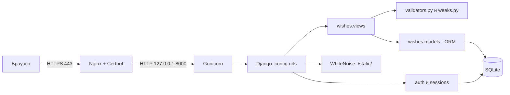
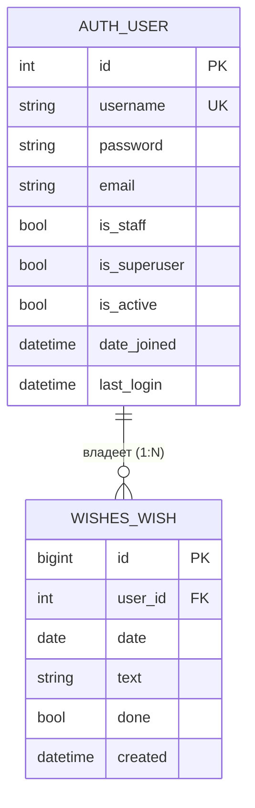

# Безопасность и валидация данных (security_validation)

| | |
|---|---|
| **Проект** | Вишлист по неделям (Django, монолит) |
| **Роль** | Специалист по безопасности и валидации данных |
| **Автор** | <ФИО студента> |
| **Репозиторий** | 2-sentyabrya-pary-1-3, папка `task_3_security` |
| **Код проекта** | [`wishlist_django/`](../wishlist_django) |

> Документ состоит из **Части A** (общие разделы 1–6, одинаковые для всех ролей) и **Части B** (акценты роли «Специалист по безопасности и валидации данных», в конце план презентации).

---

# ЧАСТЬ A. Общие разделы

## 1. Описание бизнес-логики проекта

**Какую задачу решает система.** «Вишлист по неделям» — веб-приложение для личного планирования желаний: пользователь раскладывает желания (покупки, поездки, дела) по дням недели, отмечает исполненные и видит прогресс недели. Данные каждого пользователя изолированы и доступны только ему после входа.

### 1.1 Сценарии использования (user stories)

| ID | Как… | Хочу… | Чтобы… |
|---|---|---|---|
| US-1 | пользователь | войти по логину и паролю | видеть только свои желания |
| US-2 | пользователь | видеть текущую неделю по дням | планировать на неделю вперёд |
| US-3 | пользователь | листать недели вперёд и назад | смотреть прошлое и планировать будущее |
| US-4 | пользователь | добавить желание в конкретный день | зафиксировать идею |
| US-5 | пользователь | отметить желание выполненным и снять отметку | видеть, что уже исполнено |
| US-6 | пользователь | удалить желание | убирать неактуальное |
| US-7 | пользователь | видеть «выполнено X из Y» за неделю | оценивать прогресс |
| US-8 | администратор | создавать пользователей в `/admin/` | управлять доступом (публичной регистрации нет) |
| US-9 | пользователь | выйти из системы | закрыть доступ на чужом устройстве |

**Use case UC-1 «Добавить желание».** Актор: пользователь. Предусловие: выполнен вход.
Основной поток: (1) выбирает день; (2) вводит текст; (3) нажимает «+» или Enter; (4) система проверяет дату и текст; (5) сохраняет желание с привязкой к пользователю; (6) показывает обновлённую неделю.
Альтернативы: 4a — текст пустой, длиннее 300 символов или дата вне 2000–2100: желание не создаётся, неделя показывается без изменений; 1a — сессия истекла: перенаправление на страницу входа.

### 1.2 Ключевые сущности и их поведение

| Сущность | Что это | Поведение |
|---|---|---|
| `User` | учётная запись (`django.contrib.auth`) | аутентификация, хранение хеша пароля, права |
| `Wish` | желание на конкретный день | `toggle()`, `clean()`, `__str__()` |
| `WeekCalendar` | вычисляемая неделя пн–вс (в БД не хранится) | `monday`, `sunday`, `number`, `dates()`, `contains()`, `shifted()` |
| `TextValidator`, `DateValidator` | валидаторы ввода | очистка и проверка текста и даты |

### 1.3 Бизнес-правила

| № | Правило |
|---|---|
| BR-1 | Желание принадлежит ровно одному пользователю. Чужие желания недоступны (ответ 404). |
| BR-2 | Текст: строка, после очистки от лишних пробелов и управляющих символов длина 1–300. |
| BR-3 | Дата: формат ГГГГ-ММ-ДД, год 2000–2100. |
| BR-4 | Неделя по ISO 8601: понедельник–воскресенье, номер недели по ISO. |
| BR-5 | Новое желание всегда «не выполнено»; `toggle()` переключает статус. |
| BR-6 | Порядок в дне: сначала невыполненные, затем выполненные; внутри — по времени создания. |
| BR-7 | Удаление необратимо. При удалении пользователя удаляются и его желания (CASCADE). |
| BR-8 | Изменения данных — только методом POST и с CSRF-токеном. |
| BR-9 | Некорректный параметр недели `?d=` → показывается текущая неделя. |
| BR-10 | Публичной регистрации нет, пользователей создаёт администратор. |

## 2. Тип архитектуры: монолит

**Выбор: монолит** (одно Django-приложение, MVT: Model–View–Template).

**Обоснование:** одна предметная область (желания по дням), один разработчик/команда студентов, нагрузка — десятки пользователей, нужно быстро развернуть и просто сопровождать. Микросервисы добавили бы сетевые вызовы, отдельные БД, оркестрацию и распределённую безопасность без реальной пользы.



| Слой / модуль | Ответственность |
|---|---|
| `config/` | настройки, маршруты, WSGI |
| `wishes/urls.py` | маршруты приложения |
| `wishes/views.py` | контроллеры: приём запроса, проверки доступа, ответ |
| `wishes/validators.py`, `wishes/weeks.py` | бизнес-логика без зависимости от Django |
| `wishes/models.py` | модель `Wish`, доступ к БД через ORM |
| `templates/` | представление (HTML) |
| Nginx / Gunicorn | веб-сервер и сервер приложений |

| Плюсы для проекта | Минусы / ограничения |
|---|---|
| Простая разработка, отладка и развёртывание | Масштабируется только целиком |
| Одна БД, транзакции без распределённых проблем | Ошибка в одном модуле может уронить весь сайт |
| Встроенные в Django защита и админка | SQLite плохо подходит для большого числа одновременных записей |
| Дёшево: хватает одного маленького сервера | При росте команды модули придётся разделять |

*Когда пересматривать:* появятся мобильные клиенты, общие списки желаний, уведомления — тогда логично выделить API и перейти на PostgreSQL.

## 3. Хранение данных

- **СУБД:** SQLite, один файл (`DB_PATH`, на сервере `/var/lib/wishlist/db.sqlite3`).
- **Сессии:** в той же БД (таблица `django_session`).
- **Файлы:** только статика (CSS админки), собирается `collectstatic` и отдаётся WhiteNoise.
- **Кэш и облако:** не используются.
- **Резервные копии:** копирование файла БД (см. раздел «Сопровождение»).

| Сущность (таблица) | Атрибуты |
|---|---|
| `auth_user` | id, username (уникальный), password (хеш), email, first_name, last_name, is_staff, is_superuser, is_active, date_joined, last_login |
| `wishes_wish` | id, user_id (внешний ключ), date (с индексом), text (до 300 символов), done, created |
| `django_session` | session_key, session_data, expire_date |



### Виды связей в БД

| Связь | Что значит | Пример для проекта |
|---|---|---|
| **1:N** (реализована) | один пользователь — много желаний | `Wish.user = ForeignKey(User)`: у `anna` 20 желаний, у каждого желания один владелец |
| **1:1** (возможное расширение) | одна запись соответствует ровно одной | профиль пользователя: `Profile.user = OneToOneField(User)` (часовой пояс, тема оформления) |
| **M:N** (возможное расширение) | много ко многим | теги: `Wish.tags = ManyToManyField(Tag)`; желание «Поездка» с тегами «отпуск» и «друзья», тег «отпуск» у многих желаний |

В текущей версии реализована только связь 1:N; 1:1 и M:N показаны как план развития и в миграциях отсутствуют.

## 4. Проверка безопасности приложения

| Угроза | Актуальна? | Мера защиты | Где в проекте |
|---|---|---|---|
| SQL-инъекция | да | ORM с параметризованными запросами, сырой SQL не используется | `models.py`, `views.py` |
| XSS | да | автоэкранирование шаблонов Django; текст желания не помечается как `safe` | `templates/wishes/week.html` |
| CSRF | да | `CsrfViewMiddleware`, `` во всех формах, изменения только POST | `settings.py`, `@require_POST` |
| Слабая аутентификация | да | пароли хешируются (PBKDF2-SHA256 по умолчанию), `AUTH_PASSWORD_VALIDATORS`, публичной регистрации нет | `settings.py` |
| Доступ к чужим данным (IDOR) | да | выборка только `user=request.user`, иначе 404 | `views.py: toggle, delete, week` |
| Утечка секретов | да | `SECRET_KEY` и хосты берутся из переменных окружения; при `DEBUG=0` без ключа запуск прерывается | `settings.py` |
| Перехват трафика | да | HTTPS (Let's Encrypt), `SESSION_COOKIE_SECURE`, `CSRF_COOKIE_SECURE`, `SECURE_PROXY_SSL_HEADER` | nginx, `settings.py` |
| Clickjacking | да | `XFrameOptionsMiddleware` | `settings.py` |
| Некорректный ввод | да | `TextValidator`, `DateValidator`, повторная проверка на сервере | `validators.py` |
| Подбор пароля | да | **пока не реализовано** (рекомендации: django-axes или fail2ban, ограничение запросов в nginx) | — |
| Логирование и аудит | частично | журналы nginx и `journalctl -u wishlist`; бизнес-аудит не ведётся | сервер |

**Инкапсуляция и защита данных в коде.** Состояние классов хранится в приватных атрибутах (`_max_length`, `_min_year`, `_monday`); наружу оно выходит только через свойства (геттеры) и сеттер с проверкой (`max_length`, `set_anchor()`). Метод `_check()` защищённый и вызывается только через `__call__`. Типы проверяются явно (`isinstance`), при нарушении поднимается `ValueError`.

## 5. Законы и нормативные акты для внедрения ИС

> Учебный материал, не юридическая консультация. Перед реальным запуском сверьтесь с актуальной редакцией законов.

| Акт | Что важно для проекта |
|---|---|
| **152-ФЗ «О персональных данных»** | Логин, e-mail, IP-адреса в журналах и текст желаний (может содержать личные сведения) — персональные данные. Нужны правовое основание, цели обработки, меры защиты. С 1 сентября 2025 г. (ФЗ от 24.06.2025 № 156-ФЗ) согласие оформляется **отдельно** от других документов и условий. |
| **242-ФЗ (изменения в 152-ФЗ)** | Первичный сбор и хранение ПДн граждан РФ — в базах на территории РФ. Это важно при выборе страны размещения сервера. |
| **149-ФЗ «Об информации, информационных технологиях и о защите информации»** | Обязанности по защите информации и ограничению доступа к ней. |
| **GDPR** (если пользователи или сервер в ЕС) | Законность и прозрачность обработки (ст. 5–6, 13), права пользователя (доступ, удаление), безопасность обработки (ст. 32), уведомление о утечке в 72 часа (ст. 33). |

**Что учесть при сборе, хранении и обработке:**
1. Собирать минимум: логин, пароль (только хеш), текст желаний. E-mail не обязателен.
2. Если появится публичная регистрация: страница **политики конфиденциальности**, **отдельная** галочка согласия (не включённая в пользовательское соглашение), возможность удалить аккаунт и данные.
3. Определить сроки хранения и порядок удаления данных; хранить резервные копии не дольше необходимого.
4. Разместить сервер в допустимой юрисдикции; при передаче данных третьим лицам (хостинг, почта) — отдельные основания.
5. Иметь процедуру реагирования на инциденты (уведомление Роскомнадзора по 152-ФЗ, надзорного органа по GDPR).
6. Cookies: проект использует только технические (сессия, CSRF), без аналитики и рекламы.

## 6. Документы к каждому этапу разработки

| Этап | Документы | Где в репозитории |
|---|---|---|
| Анализ требований | список требований, user stories, бизнес-правила | Часть A, разделы 1.1–1.3 |
| Проектирование | UML классов и последовательностей, ER-диаграмма, схема архитектуры | `task_1_architect/uml_class_diagram.md`, разделы 2–3 |
| Разработка | описание модулей, структура кода, docstring, README | `wishlist_django/`, `task_5_devops/` |
| Тестирование | тест-план, чек-листы, отчёты о дефектах, автотесты | `task_4_qa/qa_test_plan.md`, `wishes/tests.py`, `wishes/test_pure.py` |
| Внедрение | инструкция по развёртыванию, руководство пользователя, план миграции | `docs/guide_wishlist.md`, `task_5_devops/` |
| Сопровождение | регламент обновлений, резервное копирование, мониторинг | `task_5_devops/devops_documentation.md` |

---

# ЧАСТЬ B. Акценты роли: Специалист по безопасности и валидации данных

## B1. Приватные и защищённые атрибуты

| Атрибут | Тип доступа | Класс | Как читать / менять снаружи |
|---|---|---|---|
| `_max_length` | приватный (по соглашению `_`) | `TextValidator` | свойство `max_length` (get/set с проверкой) |
| `_min_year`, `_max_year` | приватные | `DateValidator` | только чтение: `min_year`, `max_year` |
| `_monday` | приватный | `WeekCalendar` | чтение: `monday`; изменение: `set_anchor()` |
| `_check()` | защищённый метод | `BaseValidator` и наследники | вызывается только через `__call__` |

> Атрибуты с одним `_` — защищённые/приватные «по соглашению». Если нужна настоящая обфускация имени (`__attr`, name mangling), её можно применить так же, но для Django-моделей это не требуется.

## B2. Сеттеры и геттеры как «фильтры»

```python
@property
def max_length(self):                      # геттер
    return self._max_length

@max_length.setter
def max_length(self, value):               # сеттер-фильтр
    if isinstance(value, bool) or not isinstance(value, int) or value < 1:
        raise ValueError("max_length должен быть целым числом >= 1")
    self._max_length = value
```
Нельзя записать `0`, `-1`, `"5"`, `True`, `None`, `2.5`: некорректное значение не попадает в объект.

## B3. Проверки типов и значений

```python
# TextValidator._check
if not isinstance(value, str):
    raise ValueError("Текст желания должен быть строкой")
cleaned = _CONTROL_CHARS.sub(" ", value)      # убираем управляющие символы
cleaned = " ".join(cleaned.split())           # схлопываем пробелы
if not cleaned:
    raise ValueError("Текст желания не может быть пустым")
if len(cleaned) > self._max_length:
    raise ValueError(f"Текст длиннее {self._max_length} символов")
```
`DateValidator._check` принимает `str` (ГГГГ-ММ-ДД), `date`, `datetime`, остальные типы отвергает, затем проверяет диапазон лет 2000–2100.

## B4. Исключения и обработка ошибок

| Ситуация | Исключение / ответ | Где обрабатывается |
|---|---|---|
| плохой текст или дата | `ValueError` | `views.add` ловит и не создаёт запись |
| плохой текст при сохранении через админку | `ValidationError` (из `Wish.clean`) | форма админки показывает ошибку у поля |
| плохой параметр `?d=` | `ValueError` | `views._date_or` подставляет текущую неделю |
| чужое или несуществующее желание | `Http404` | `get_object_or_404(..., user=request.user)` |
| GET вместо POST на `/add/`, `/toggle/`, `/delete/` | 405 | `@require_POST` |
| запрос без CSRF-токена | 403 | `CsrfViewMiddleware` |
| неавторизованный доступ | 302 на `/accounts/login/` | `@login_required` |

## B5. Модуль валидации: примеры

| Вызов | Результат |
|---|---|
| `clean_text("  Купить   книгу \n")` | `'Купить книгу'` |
| `clean_text("a\x00b")` | `'a b'` |
| `clean_text("")`, `clean_text("   ")` | `ValueError` |
| `clean_text("a" * 300)` / `("a" * 301)` | OK / `ValueError` |
| `clean_text(None)`, `clean_text(123)` | `ValueError` |
| `clean_date("2026-10-07")` | `datetime.date(2026, 10, 7)` |
| `clean_date("2026-02-30")`, `("31.12.2026")`, `("")` | `ValueError` |
| `clean_date("1999-12-31")` / `("2101-01-01")` | `ValueError` |

Все эти случаи покрыты автотестами `wishes/test_pure.py` (см. роль QA).

## B6. Защитные настройки Django

```python
# config/settings.py (фрагменты)
SECRET_KEY = os.environ.get("SECRET_KEY", "")      # не хранится в коде
if not SECRET_KEY and not DEBUG:
    raise ImproperlyConfigured("Задай переменную окружения SECRET_KEY")

if not DEBUG:
    SECURE_PROXY_SSL_HEADER = ("HTTP_X_FORWARDED_PROTO", "https")
    SESSION_COOKIE_SECURE = True
    CSRF_COOKIE_SECURE = True

AUTH_PASSWORD_VALIDATORS = [ ... ]                  # длина, похожесть, частые, только цифры
```
Пароли хранятся только в виде хеша (по умолчанию PBKDF2-SHA256 с солью). SQL-запросы выполняет ORM с параметризацией. Шаблоны экранируют HTML.

## B7. Как проверить безопасность

```bash
# Проверка настроек перед выкладкой (покажет предупреждения по HTTPS, HSTS, cookie и т.д.)
SECRET_KEY=... ALLOWED_HOSTS=wish.example.com python manage.py check --deploy
# Автотесты безопасности
DEBUG=1 python manage.py test wishes.tests.ViewTests -v 2
```
Тесты безопасности в `wishes/tests.py`: `test_csrf_is_enforced`, `test_xss_is_escaped`, `test_sql_injection_is_stored_as_plain_text`, `test_foreign_wish_is_protected`, `test_login_required_redirects`, `test_get_not_allowed_for_actions`.

## B8. Законы и их применение к проекту

| Требование закона | Техническая / организационная мера |
|---|---|
| 152-ФЗ: законность и цели обработки | цель — ведение личного вишлиста; собираем минимум данных |
| 152-ФЗ: согласие отдельным документом (с 01.09.2025) | при публичной регистрации — отдельная галочка и страница политики; сейчас аккаунты выдаёт администратор |
| 152-ФЗ / 242-ФЗ: защита и локализация | пароли в виде хеша, HTTPS, разграничение доступа, сервер для данных граждан РФ — на территории РФ |
| GDPR ст. 32: безопасность обработки | шифрование канала, контроль доступа, резервные копии; рекомендуется шифровать копии |
| GDPR ст. 17 / 152-ФЗ: удаление данных по запросу | удаление пользователя в `/admin/` каскадно удаляет его желания (BR-7) |
| GDPR ст. 33 / 152-ФЗ: инциденты | процедура уведомления (регулятор и пользователи) — см. документ DevOps |

## B9. Известные ограничения и рекомендации

1. Нет защиты от подбора пароля → добавить `django-axes` или `fail2ban`, ограничение запросов `limit_req` в nginx.
2. Нет двухфакторной аутентификации → при необходимости `django-otp`.
3. HSTS не включён → после проверки HTTPS добавить `SECURE_HSTS_SECONDS`.
4. Нет бизнес-аудита (кто что удалил) → при росте проекта добавить логирование действий.

## B10. Презентация (5–7 слайдов)

1. Что защищаем: данные, пользователи, сервер.
2. Угрозы: SQLi, XSS, CSRF, IDOR, слабые пароли (таблица).
3. Инкапсуляция: приватные атрибуты, геттеры/сеттеры-фильтры.
4. Валидация: код `TextValidator`, таблица примеров.
5. Исключения и коды ответов (400/403/404/405).
6. Тесты безопасности и `check --deploy`.
7. Законы: 152-ФЗ, 242-ФЗ, GDPR и меры; ограничения и план улучшений.
