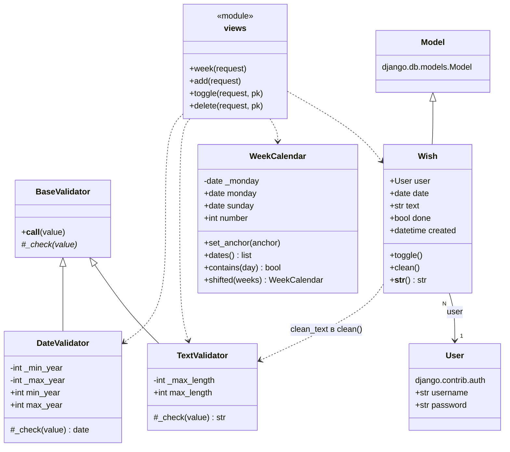
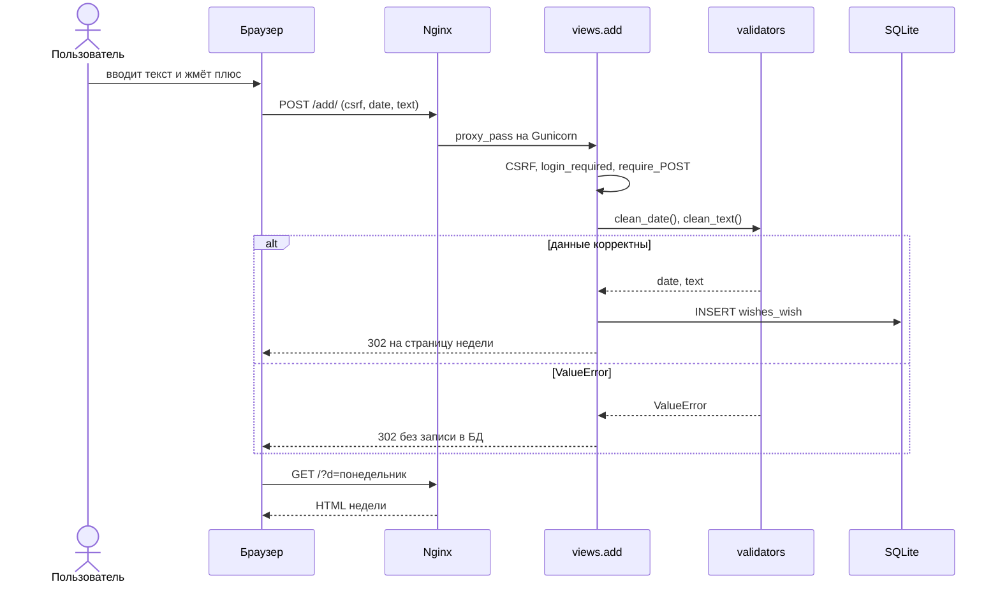

# UML-диаграммы проекта «Вишлист»

## Диаграмма классов

```mermaid
classDiagram
    class BaseValidator {
        +__call__(value)
        #_check(value)*
    }
    class TextValidator {
        -int _max_length
        +int max_length
        #_check(value) str
    }
    class DateValidator {
        -int _min_year
        -int _max_year
        +int min_year
        +int max_year
        #_check(value) date
    }
    class WeekCalendar {
        -date _monday
        +date monday
        +date sunday
        +int number
        +set_anchor(anchor)
        +dates() list
        +contains(day) bool
        +shifted(weeks) WeekCalendar
    }
    class Model {
        django.db.models.Model
    }
    class Wish {
        +User user
        +date date
        +str text
        +bool done
        +datetime created
        +toggle()
        +clean()
        +__str__() str
    }
    class User {
        django.contrib.auth
        +str username
        +str password
    }
    class views {
        <<module>>
        +week(request)
        +add(request)
        +toggle(request, pk)
        +delete(request, pk)
    }
    BaseValidator <|-- TextValidator
    BaseValidator <|-- DateValidator
    Model <|-- Wish
    Wish "N" --> "1" User : user
    Wish ..> TextValidator : clean_text в clean()
    views ..> Wish
    views ..> WeekCalendar
    views ..> TextValidator
    views ..> DateValidator
```

## Диаграмма последовательности: добавление желания

```mermaid
sequenceDiagram
    actor U as Пользователь
    participant B as Браузер
    participant N as Nginx
    participant V as views.add
    participant C as validators
    participant DB as SQLite
    U->>B: вводит текст и жмёт плюс
    B->>N: POST /add/ (csrf, date, text)
    N->>V: proxy_pass на Gunicorn
    V->>V: CSRF, login_required, require_POST
    V->>C: clean_date(), clean_text()
    alt данные корректны
        C-->>V: date, text
        V->>DB: INSERT wishes_wish
        V-->>B: 302 на страницу недели
    else ValueError
        C-->>V: ValueError
        V-->>B: 302 без записи в БД
    end
    B->>N: GET /?d=понедельник
    N-->>B: HTML недели
```
